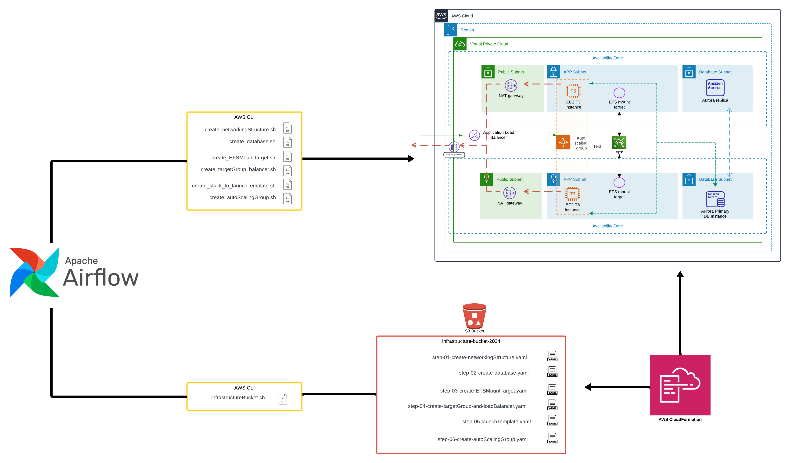
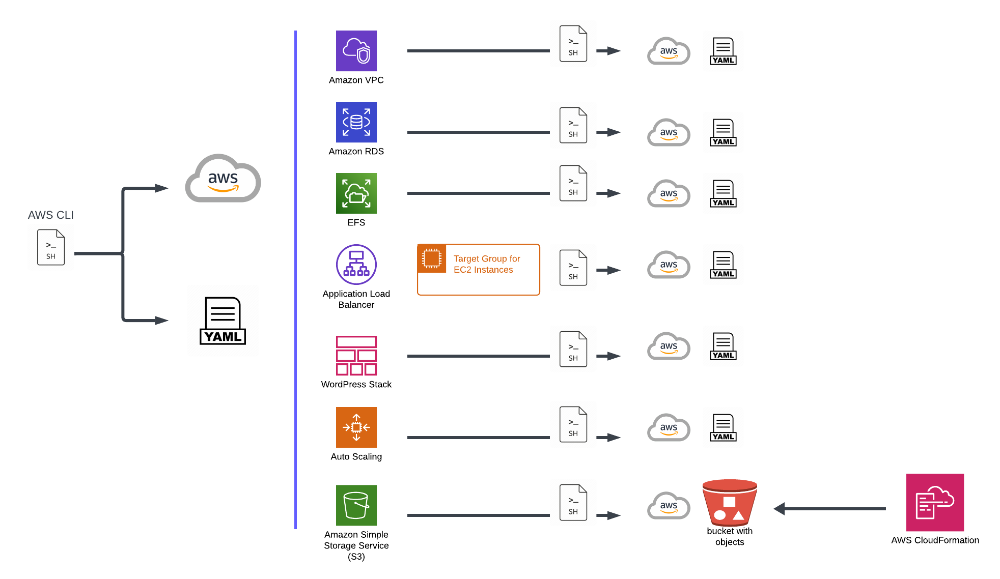
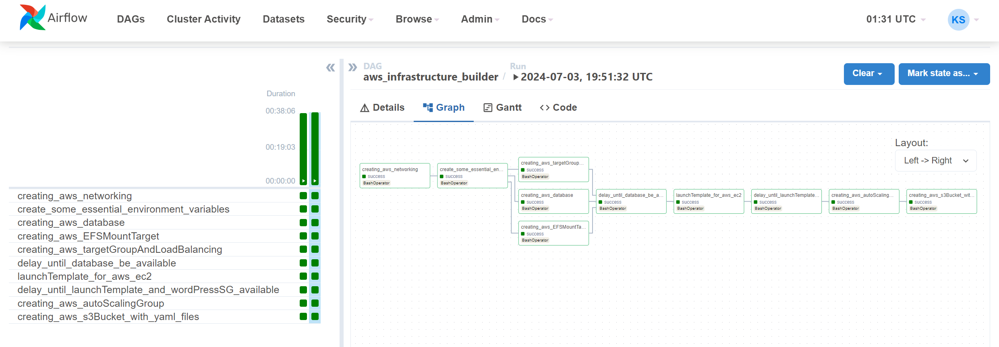
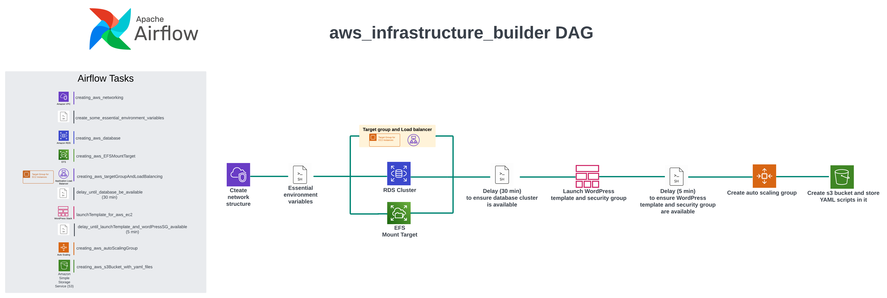
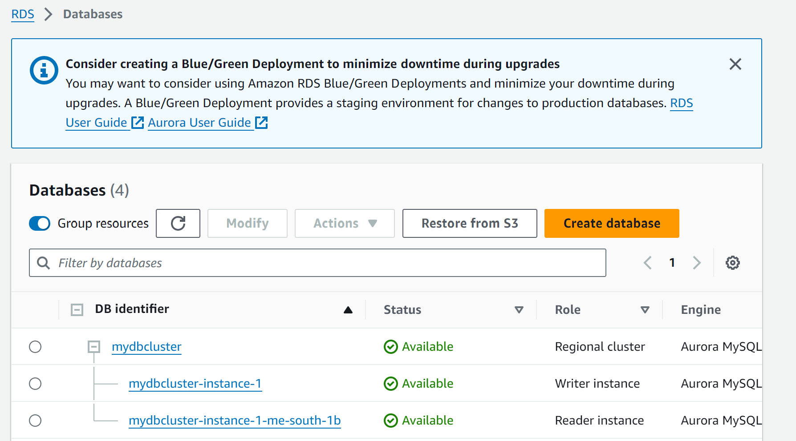
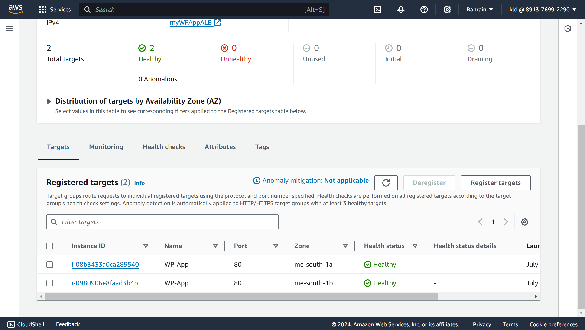
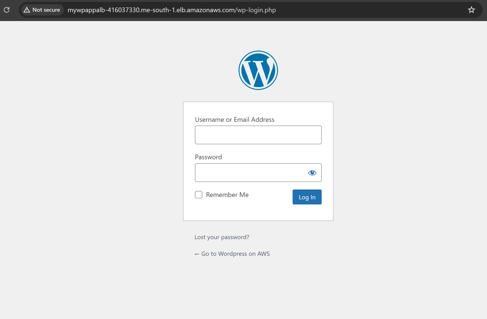

## Project Overview

This project demonstrates how to create AWS infrastructure using Apache Airflow to launch a WordPress web application. The infrastructure is built using the AWS CLI, and the same shell scripts that contain the AWS CLI commands also generate CloudFormation YAML templates. These YAML templates are stored in an S3 bucket for future use, ensuring that any damaged parts of the infrastructure can be quickly rebuilt without needing to manually use the AWS console.

## Key Components
**1. Network Structure:**
- Virtual Private Cloud (VPC)
- Subnets
- Internet gateway
- Elastic IPs
- Nat gateway
- Route Tables
- Security Groups

**2. Database:**
- Amazon RDS for the database backend

**3. Storage:**
- Amazon EFS (Elastic File System) Mount Target

**4. Load Balancing and Scaling:**
- Target Group
- Load Balancer
- Auto Scaling Group

## Setup Scripts
The setupScripts folder contains six shell scripts that automate the creation of AWS infrastructure components. Each script uses AWS CLI commands to set up specific parts of the infrastructure in the AWS cloud and generates corresponding CloudFormation YAML files for future use. These YAML files are stored in an S3 bucket created by the `aws_infrastructure_bucket/infrastructureBucket.sh script`, ensuring that the infrastructure can be easily rebuilt if needed. The scripts are designed to work in the Bahrain region (me-south-1a and me-south-1b availability zones).

## Scripts Overview (Manual Execution)
***Note***: It is recommended to run these scripts manually in order before transitioning to **Airflow execution**. This helps ensure that every part of the infrastructure is correctly set up without any issues.

**1. `create_networkingStructure.sh`**
- **Description:** Sets up the networking structure in AWS, including VPC, subnets, internet gateway, NAT gateways,Elastic IPs(required for NAT gateways), route tables, and security groups.
- **Manual Execution:** Run `create_networkingStructure.sh` first to build the networking infrastructure and generate a CloudFormation YAML file `step-01-create-networkingStructure.yaml`.

**2. `create_database.sh`**
- **Description:** Creates a DB subnet group and a database cluster with two instances spread across two availability zones.
- **Manual Execution:** Run `create_database.sh` second to build the database infrastructure and generate a CloudFormation YAML file `step-02-create-database.yaml`.

**3. `create_EFSMountTarget.sh`**
- **Description:** Creates an EFS Mount Target in two availability zones.
- **Manual Execution:** Run `create_EFSMountTarget.sh` third to build the EFS infrastructure and generate a CloudFormation YAML file `step-03-create-EFSMountTarget.yaml`.

**4. `create_targetGroup_balancer.sh`**
- **Description:** Creates a target group and load balancer.
- **Manual Execution:** Run `create_targetGroup_balancer.sh` fourth to build the target group and load balancer infrastructure and generate a CloudFormation YAML file `step-04-create-targetGroup-and-loadBalancer.yaml`.

**5. `create_stack_to_launchTemplate.sh`**
- **Description:** Creates a task in AWS cloudFormation using an existing YAML script `CloudFormation_yaml/step-05-launchTemplate.yaml` to launch a template for instance creation in an auto scaling group, including a security group for the WordPress web application.
- **Manual Execution:** Run `create_stack_to_launchTemplate.sh` fifth and use an existing YAML file at `CloudFormation_yaml/step-05-launchTemplate.yaml` to create a launch template for instances and security group for the WordPress web application.

**6. `create_autoScalingGroup.sh`**
- **Description:** Creates an auto scaling group.
- **Manual Execution:** Run `create_autoScalingGroup.sh` last to build the auto scaling group infrastructure and generate a CloudFormation YAML file `step-06-create-autoScalingGroup.yaml`.

## Orchestrating Infrastructure Setup Using Airflow
This section demonstrates how to set up Apache Airflow to orchestrate the creation of AWS infrastructure. Follow the steps below to set up Airflow, initialize it, and configure it to run the necessary tasks.

#### **1. Create a Python Virtual Environment:**
- `python3 -m venv airflow_venv`
#### **2. Activate your Python environment:**
- `source airflow_venv/bin/activate`
#### **3. Install Apache Airflow:**
- `pip install apache-airflow`
#### **4. Before starting Airflow, you need to initialize the backend database:**
- `airflow db init`
- This command will create an Airflow folder in your home directory (~/airflow).
#### **5. Configure Airflow:**
- Inside the `~/airflow` folder, open the `airflow.cfg` file and search for the `load_examples` setting. Change its value from `True` to `False`
- `load_examples = True` to this `load_examples = False`
#### **6. Create an admin user with the following command (replace with your information):**
- `airflow users create --role Admin --username admin --email admin --firstname admin --lastname admin --password admin`
#### **7. Start the Airflow Web Server:**
- `airflow webserver -p 8080`
- Open your browser and go to `http://localhost:8080` to log in to your Airflow account using the credentials you created.
#### **8. Start the Airflow Scheduler:**
- In a new terminal, start the Airflow scheduler to enable task scheduling and execution
- `airflow scheduler`
#### **9. Set Up The DAG:**
- Navigate to the `~/airflow` folder and create a new directory called `dags`. Inside the dags folder, create a new file named `aws_infrastructure_builder_dag.py`. Copy the Python script from `airflow/aws_infrastructure_builder_dag.py` in this repository to the new file. Make sure to update the paths to your local files as needed.
#### **10. Execute the DAG:**
- Go to the Airflow UI, find the `aws_infrastructure_builder` in the list of DAGs, and trigger it to start orchestrating the infrastructure setup.

## Executing the Airflow DAGs

This section demonstrates the execution of the Airflow DAGs to orchestrate the AWS infrastructure setup. Below is an image showing the DAGs after execution, followed by a detailed explanation of each task and the order in which they were run.

### Execution Steps:

**1. Run `aws_networking_task`**
- This task sets up the networking structure in AWS, including VPC, subnets, internet gateway, NAT gateways, Elastic IPs (required for NAT gateways), route tables, and security groups.
- Wait for this task to complete before proceeding to the next step.

**2. Run `variables_for_configuration_task`**
- This task sets up the necessary configuration variables for the subsequent tasks, `MASTER_USERPASSWORD`, `MASTER_USERNAME`, `EMAIL`.
- Ensure this task completes before moving forward.

**3. Run `aws_database_task`, `aws_EFSMountTarget_task`, and `aws_loadBalancing_task` in parallel**
- **`aws_database_task`:** Creates a DB subnet group and a database cluster with two instances spread across two availability zones.
- **`aws_EFSMountTarget_task`:** Creates an EFS Mount Target in two availability zones.
- **`aws_loadBalancing_task`:** Creates a target group and load balancer.
- These tasks are run in **parallel** to optimize execution time.

**4. Run `delay_30min_task`**
- This task executes a bash script to introduce a **30-minute delay**, ensuring that the database cluster with two instances is fully available before proceeding.

**5. Run `aws_launchTemplate_task`**
- Creates a task using an existing YAML script `CloudFormation_yaml/step-05-launchTemplate.yaml` to launch a template for instance creation in an auto scaling group, including a security group for the WordPress web application.

**6. Run `delay_5min_task`**
- This task introduces a **5-minute delay** to ensure that the launch template and WordPress security group are fully available.

**7. Run `aws_autoScalingGroup_task`**
- Creates an auto scaling group using the previously defined launch template.
- Ensure this task completes before moving forward.

**8. Run `aws_createBucket_task`**
- Stores all generated CloudFormation YAML files in the S3 bucket by executing the `aws_infrastructure_bucket/infrastructureBucket.sh` script.

## Verification of Infrastructure Setup
After executing the Airflow DAGs, it’s important to check that the AWS infrastructure has been set up correctly and that the WordPress **web application is working**. Below are images showing the database after creation and the WordPress web application.

**RDS cluster with its instances**

**Target Group with Healthy Status**

**WordPress web application**

## Final Verification Steps
**1. Obtain the Load Balancer DNS Name**
- Go to the AWS Management Console.
- Navigate to the EC2 service and then to the  Load Balancers section.
- Find the DNS name of your load balancer.

**2. Verify WordPress web application is work**
- Copy the DNS name of the load balancer.
- Open a new browser tab and paste the DNS name in the address bar.
- Add `/wp-login.php` to the end of the DNS name and press Enter. For example `http://<load-balancer-dns-name>/wp-login.php`

If the WordPress login page appears, it confirms that the WordPress web application is up and running.

